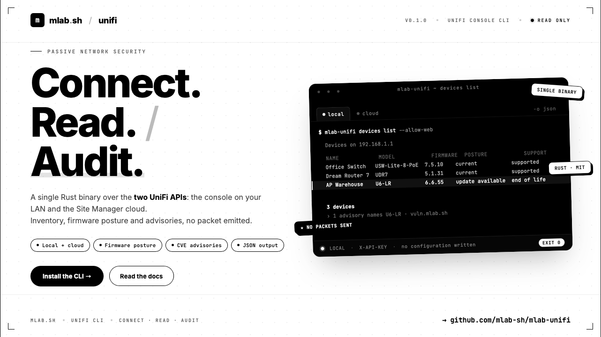

# mlab-unifi



**A CLI over the UniFi APIs, built as a base for passive network security
work.**

It talks to a UniFi console on the LAN or to a UniFi Site Manager account in
the cloud, both with the same `X-API-KEY` header, and a profile in
`$HOME/.mlab/unify.conf` says which one to reach and how.

It reads. Nothing changes a configuration except the device actions you ask for
explicitly, and no data leaves your machine unless a command says it does and
you pass the flag that allows it.

Requires UniFi Network 9.x or later on the console.

## Install

**Homebrew** (macOS and Linux)

```bash
brew tap mlab-sh/mlab-unifi https://github.com/mlab-sh/mlab-unifi.git
brew install mlab-unifi
```

**Debian and Ubuntu**: download the `.deb` for your architecture from the
[releases page](https://github.com/mlab-sh/mlab-unifi/releases), then:

```bash
sudo apt install ./mlab-unifi_1.0.0_amd64.deb
```

**Fedora, RHEL and rebuilds**: the same with the `.rpm`:

```bash
sudo dnf install ./mlab-unifi-1.0.0-1.x86_64.rpm
```

**Prebuilt binary** (macOS and Linux, x86_64 and arm64): a tarball from the same
page. The Linux builds are linked against glibc 2.35, so Debian 12 and Ubuntu
22.04 and newer.

Every release carries a `SHA256SUMS` file covering all of its assets:

```bash
sha256sum -c --ignore-missing SHA256SUMS
```

**From source** (a recent Rust toolchain):

```bash
git clone https://github.com/mlab-sh/mlab-unifi.git
cd mlab-unifi && cargo build --release
```

See [Install](https://github.com/mlab-sh/mlab-unifi/wiki/Install) for the
details, and [Releasing](https://github.com/mlab-sh/mlab-unifi/wiki/Releasing)
for how these packages are built.

## First run

Get an API key from the console UI (**Settings, Control Plane, Integrations**),
or from unifi.ui.com for cloud mode, then:

```bash
mlab-unifi login --name lab --host 192.168.1.1
mlab-unifi ping
mlab-unifi audit
```

`login` prompts for the key without echoing it, checks the connection, picks
the site, and writes the config file with mode 0600 in a 0700 directory.

## Commands

| Command | What it does |
| --- | --- |
| [`audit`](https://github.com/mlab-sh/mlab-unifi/wiki/Audit) | Every graded check in one report. Start here. |
| [`snapshot`](https://github.com/mlab-sh/mlab-unifi/wiki/Snapshot) | One dated, secret-free record of everything the console holds. |
| [`diff`](https://github.com/mlab-sh/mlab-unifi/wiki/Diff) | What changed between two snapshots. |
| [`login`](https://github.com/mlab-sh/mlab-unifi/wiki/Login) | Create or update a profile, prove the credentials work, save them. |
| [`ping`](https://github.com/mlab-sh/mlab-unifi/wiki/Ping) | Check that the current profile reaches its API. |
| [`info`](https://github.com/mlab-sh/mlab-unifi/wiki/Info) | The console's own version information. |
| [`sites`](https://github.com/mlab-sh/mlab-unifi/wiki/Sites) | List sites, on either mode. |
| [`devices`](https://github.com/mlab-sh/mlab-unifi/wiki/Devices) | List, inspect and act on the managed hardware of a site. |
| [`clients`](https://github.com/mlab-sh/mlab-unifi/wiki/Clients) | What is connected now, or with `--all` every client ever seen. |
| [`network`](https://github.com/mlab-sh/mlab-unifi/wiki/Network) | Segmentation, firewall zones, and what can reach the site from outside. |
| [`wifi`](https://github.com/mlab-sh/mlab-unifi/wiki/Wifi) | Wireless hardening, the neighbourhood, impostors, and airtime. |
| [`shadow`](https://github.com/mlab-sh/mlab-unifi/wiki/Shadow) | What turned up on the network that nobody announced. |
| [`posture`](https://github.com/mlab-sh/mlab-unifi/wiki/Posture) | What the site's settings say it is defending, and with what. |
| [`footprint`](https://github.com/mlab-sh/mlab-unifi/wiki/Footprint) | What this site looks like from the outside. |
| [`blast`](https://github.com/mlab-sh/mlab-unifi/wiki/Blast) | What a compromised client would reach. |
| [`live`](https://github.com/mlab-sh/mlab-unifi/wiki/Live) | Attach to a console event stream and print what arrives. |
| [`hosts`](https://github.com/mlab-sh/mlab-unifi/wiki/Hosts) | Consoles visible on a Site Manager account (cloud only). |
| [`api`](https://github.com/mlab-sh/mlab-unifi/wiki/Api) | Raw request against any surface, for everything not wrapped yet. |
| [`profile`](https://github.com/mlab-sh/mlab-unifi/wiki/Configuration) | List, show, select and delete saved profiles. |
| [`config`](https://github.com/mlab-sh/mlab-unifi/wiki/Configuration) | Where the config file is, and what is in it. |

Every command renders to the terminal by default and to raw JSON with
`-o json`. See [Output](https://github.com/mlab-sh/mlab-unifi/wiki/Output).

## Documentation

Everything lives in the **[wiki](https://github.com/mlab-sh/mlab-unifi/wiki)**,
one page per command plus the concepts they rest on:

- [Install](https://github.com/mlab-sh/mlab-unifi/wiki/Install), building and
  first run.
- [Configuration](https://github.com/mlab-sh/mlab-unifi/wiki/Configuration),
  profiles and the precedence between flags, environment and file.
- [Surfaces](https://github.com/mlab-sh/mlab-unifi/wiki/Surfaces), the three
  HTTP APIs a console answers on and what each one is worth.
- [Identity](https://github.com/mlab-sh/mlab-unifi/wiki/Identity), how a MAC
  becomes a named device.
- [Passive security](https://github.com/mlab-sh/mlab-unifi/wiki/Passive-Security),
  the catalogue of defensive work this data supports without emitting a packet
  at a target.
- [Secrets](https://github.com/mlab-sh/mlab-unifi/wiki/Secrets), why a
  read-only API key is not read-only in the way you would hope.
- [Roadmap](https://github.com/mlab-sh/mlab-unifi/wiki/Roadmap), what is built
  and what is next.

The pages are written in [`wiki/`](wiki/Home.md) in this repository and mirrored
to the GitHub wiki by
[`.github/workflows/wiki-sync.yml`](.github/workflows/wiki-sync.yml) on every
push to `main` that touches them. The repository is the source of truth, so
edit the files here rather than the pages in the wiki UI, which are overwritten
on the next sync.

## Layout

```
src/
  main.rs          entry point
  cli/             the clap surface, and the context a command runs in
  commands/        one file per command
  unifi/           the HTTP client, the surfaces, profiles, the registry
  enrich/          fingerprints, OUI, firmware posture, advisories
  audit.rs         the graded checks, as pure functions over fetched data
  ui/              the terminal render and the progress rules
wiki/              the documentation, mirrored to the GitHub wiki
Formula/           the Homebrew formula, regenerated at every release
.github/workflows/ the wiki sync and the release pipeline
```

Prior art for the API surface:
[colindickson/unifi](https://github.com/colindickson/unifi) (Go).
